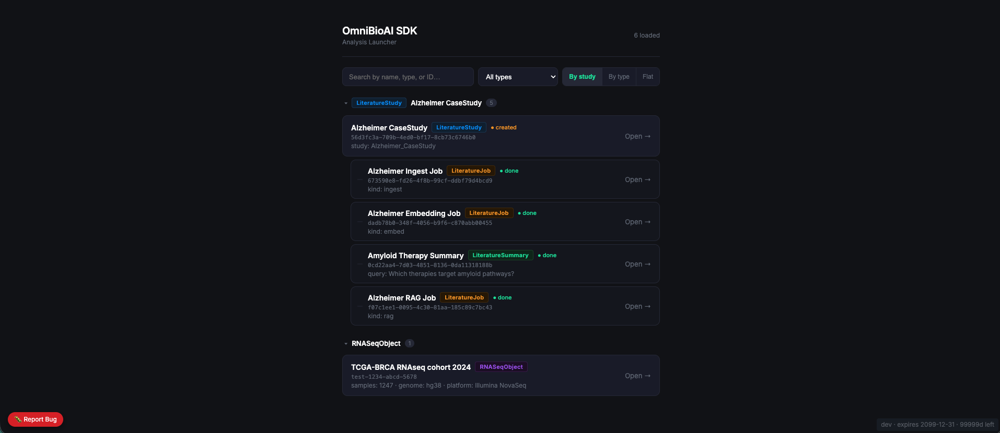

# OmniBioAI Launcher



> README last reviewed against the repository: **2026-09-12**

A browser-based gateway to interactive analysis environments for the OmniBioAI platform.
The launcher operates in two independent modes: opening a specific registry object in your
preferred IDE, and starting/stopping long-running IDE services backed by Docker containers.

This repository is intentionally separate from
[omnibioai-sdk](https://github.com/OmniBioAI/omnibioai-sdk), the pure Python API client.
The launcher is the browser entry point; the SDK is for programmatic use inside notebooks
and scripts.

---

## Overview

| Mode | What it does |
|---|---|
| **Object Launch** | Browse the registry, select an object, open it in JupyterLab, VS Code, or RStudio with context pre-loaded |
| **IDE Services** | Start / stop containerised JupyterLab, RStudio, and VS Code Server from the Launcher UI |

The two modes are independent — IDE Services can be used without an object context, and
Object Launch can target an already-running environment on the configured host.

---

## Supported Environments

| Environment | Description | Default port |
|---|---|---|
| **JupyterLab** | Full bioinformatics kernel (scanpy, DESeq2, scVelo, cellxgene …) | 8888 |
| **RStudio** | R with Bioconductor — Seurat, DESeq2, scran, monocle3, tidyverse | 8787 |
| **VS Code Server** | Browser editor with Python and R extensions and the Python packages listed below | 8083 |

> **Known port mismatch:** the object-launch path and lifecycle backend use port
> `8083`, but `IdeCard` currently opens `http://localhost:8080` after starting VS
> Code. Align the component or deployment before relying on that service tile.

---

## Running in OmniBioAI Stack (recommended)

The Launcher is managed automatically by OmniBioAI Studio.
No manual startup required — it starts with the full stack:

```bash
cd ~/Desktop/machine/omnibioai-studio
docker compose up -d launcher
```

Access at: `http://localhost/_svc/sdk` (via nginx, JWT required)
Direct access (localhost only): `http://localhost:5190`

The Launcher container serves the UI through nginx on port `5190`; nginx proxies
`/api/launcher/*` to the internal Express server on port `3001`. Studio owns the
IDE containers and supplies a restricted Docker socket proxy at
`/var/run/proxy-socket/docker.sock`. The Launcher starts and stops existing
containers named `omnibioai-jupyter`, `omnibioai-rstudio`, and
`omnibioai-vscode`; it does not create them.

| Service | URL | Default credential |
|---|---|---|
| JupyterLab     | http://localhost:8888 | token: `$JUPYTER_TOKEN` (set in .env)    |
| RStudio        | http://localhost:8787 | password: `$RSTUDIO_PASSWORD` (set in .env) |
| VS Code Server | http://localhost:8083 | password: `$VSCODE_PASSWORD` (set in .env)  |

Change `JUPYTER_TOKEN`, `RSTUDIO_PASSWORD`, `VSCODE_PASSWORD`, and data/work
directory variables in the Studio environment before deployment. Do not use
the development defaults in a shared or production environment.

---

## Quick Start — Object Launch

The Launcher UI is a React single-page app served on port 5190.

**With a running backend:**

```bash
npm ci
cp .env.example .env.local
npm start               # dev server at http://localhost:3000
```

Edit `.env.local` for the backend and Jupyter endpoints you use. It is ignored
by Git; `.env.example` contains the checked-in development template.

**Via Docker:**

```bash
docker build -t omnibioai-launcher .
docker run \
  -p 127.0.0.1:5190:5190 \
  -e DOCKER_SOCKET_PATH=/var/run/docker.sock \
  -v /var/run/docker.sock:/var/run/docker.sock \
  omnibioai-launcher
```

This standalone example deliberately overrides the Studio proxy path and mounts
the raw Docker socket. That mount is required only for IDE Services lifecycle
operations and grants substantial control over the host Docker daemon. Keep the
port bound to loopback, or use the Studio-managed socket proxy and authenticated
gateway for shared deployments. The three named IDE containers must already
exist on the same Docker daemon.

**Direct link from any page:**

```html
<a href="http://127.0.0.1:5190/?object_id=56d3fc3a-709b-4ed0-bf17-8cb73c6746b0">Analyze</a>
```

If no `object_id` is given, the app opens a searchable registry list. Selecting an object
shows a detail view (metadata, lineage, job log) and a button to open it in an environment.

---

## Pre-installed Packages

### JupyterLab (`docker/jupyter/Dockerfile`)

Base image: `jupyter/datascience-notebook:latest`

**Python** — scanpy, anndata, scVelo, squidpy, pyDEA, gseapy, biopython, pysam,
cellxgene, leidenalg, harmonypy, decoupler, pydeseq2, omnipath

**R / Bioconductor (via conda)** — DESeq2, edgeR, limma, Seurat

### RStudio (`docker/rstudio/Dockerfile`)

Base image: `rocker/rstudio:4.3.2`

**Bioconductor** — DESeq2, edgeR, limma, Seurat, clusterProfiler, EnhancedVolcano,
ComplexHeatmap, SingleCellExperiment, scran, scater, monocle3

**CRAN** — tidyverse, ggplot2, pheatmap, RColorBrewer, patchwork, cowplot

### VS Code Server (`docker/vscode/Dockerfile`)

Base image: `codercom/code-server:latest`

**Extensions** — ms-python.python, REditorSupport.r

**Python packages** — scanpy, anndata, scVelo, pydeseq2, gseapy, biopython, pysam

---

## Architecture

```
OmniBioAI Studio
      |
Launcher UI  (React, port 5190)
      |
  ┌───┴──────────────────────────┐
  │  Object Launch               │  IDE Services
  │  (registry object context)   │  (container lifecycle)
  └───┬──────────────────────────┘
      |                                  |
  Open object in:               browser / desktop host
  - JupyterLab  (URL + token)   GET  /api/launcher/status/{tool}
  - VS Code     (env var copy)  POST /api/launcher/start/{tool}
  - RStudio     (.R download)   POST /api/launcher/stop/{tool}
```

The `IdeCard` component in the Launcher UI polls `GET /api/launcher/status/{tool}` every
5 seconds. Clicking **Launch** calls `POST /api/launcher/start/{tool}`, polls until the
container reports `running`, then opens the service URL in a new tab. A **Stop** button
appears while the container is running. The Express server talks to the Docker
API through `DOCKER_SOCKET_PATH` (the Studio socket proxy by default); it does
not proxy object-registry requests.

### OmniBioAI nginx routing

In production the Launcher is accessed via nginx:

```
http://localhost/_svc/sdk  →  launcher:5190  (JWT required)
```

The `/api/launcher/*` endpoints are proxied to the Express backend
on port 3001 inside the container.

---

## API Endpoints

### Object registry (existing)

| Method | Endpoint | Purpose |
|---|---|---|
| `GET` | `/api/dev/objects/` | Paginated object list (`search`, `type` filters) |
| `GET` | `/api/dev/objects/{id}/` | Single object detail |
| `GET` | `/api/dev/objects/?parent_id={id}` | Children / siblings for lineage view |

Object details can also generate and download an R starter script in the
browser. The current frontend does not call a separate RStudio launch API.

### IDE services (new)

| Method | Endpoint | Purpose |
|---|---|---|
| `GET` | `/api/launcher/status/{tool}` | Container status (`running` / `starting` / `stopped`) |
| `POST` | `/api/launcher/start/{tool}` | Start the IDE container |
| `POST` | `/api/launcher/stop/{tool}` | Stop the IDE container |

`{tool}` is one of `jupyter`, `rstudio`, `vscode`. The frontend sends
`Authorization: Bearer <token>` to both API families, but `server.js` does not
validate that token and currently allows CORS from any origin. Authentication
and authorization must therefore be enforced by the Studio gateway. Do not
expose port `5190` publicly without an equivalent protective proxy.

---

## Docker Images

Pushes to `main` and version tags build the multi-platform Launcher image in
GitHub Actions and publish it as:

```
ghcr.io/omnibioai/omnibioai-launcher:latest
```

The Studio deployment may use pre-built images published to the GitHub
Container Registry:

```
ghcr.io/omnibioai/omnibioai-jupyter:1.0
ghcr.io/omnibioai/omnibioai-rstudio:1.0
ghcr.io/omnibioai/omnibioai-vscode:1.0
```

To rebuild and push:

```bash
export CR_PAT=$(gh auth token)
echo $CR_PAT | docker login ghcr.io -u man4ish --password-stdin

for tool in jupyter rstudio vscode; do
  docker build \
    -t ghcr.io/omnibioai/omnibioai-${tool}:1.0 \
    -f docker/${tool}/Dockerfile docker/${tool}/
  docker push ghcr.io/omnibioai/omnibioai-${tool}:1.0
done
```

---

## Environment Variables

### Launcher UI (baked into the bundle at build time, prefixed `REACT_APP_`)

| Variable | Default | Purpose |
|---|---|---|
| `REACT_APP_OMNIBIOAI_BASE_URL` | `http://127.0.0.1:8000` | OmniBioAI backend API base URL |
| `REACT_APP_JUPYTER_BASE` | `http://127.0.0.1:8890` | Hostname source for the Jupyter object-launch URL |
| `REACT_APP_USE_MOCK` | `false` | Use hardcoded mock data without a backend |

These values are embedded by Create React App during `npm run build`;
setting them in a runtime container environment after the build does not change
the already-generated JavaScript. **Only non-secret configuration may be passed
this way** -- everything compiled into the bundle is public. The UI holds no
credential: it sends the signed-in user's own OmniBioAI access token
(`omnibioai_access_token`, set by the host app) when one exists, and JupyterLab
authenticates the user itself -- opening a notebook shows Jupyter's own login,
which asks for the server's `JUPYTER_TOKEN` (delivered out-of-band, never through
this UI). `tests/no-browser-secret.test.mjs` (`npm run test:security`) builds the
UI with sentinel secrets and fails if any reaches the bundle.

The current object-launch code takes only the hostname from
`REACT_APP_JUPYTER_BASE` and always opens Jupyter on port `8888`; changing the
port in that variable does not change the launched port.

### Launcher lifecycle server (runtime)

Every `/api/launcher/*` route requires a verified IAM bearer token (confirmed with
omnibioai-auth's `/auth/validate`); starting or stopping a tool additionally needs
`platform.manage_infra`. It fails closed: no token, an invalid token, or an
unreachable auth service all deny. The UI sends the signed-in user's own token.

| Variable | Default | Purpose |
|---|---|---|
| `DOCKER_SOCKET_PATH` | `/var/run/proxy-socket/docker.sock` | Unix socket used for Docker lifecycle requests |
| `IAM_URL` | `http://auth-service:8001` | omnibioai-auth base URL used to verify bearer tokens |

### Studio Compose services (runtime)

| Variable | Default | Purpose |
|---|---|---|
| `JUPYTER_TOKEN` | `omnibioai` | JupyterLab authentication token |
| `RSTUDIO_PASSWORD` | `omnibioai` | RStudio login password |
| `VSCODE_PASSWORD` | `omnibioai` | VS Code Server login password |
| `OMNIBIOAI_DATA_DIR` | `./data` | Host path mounted as `/data` in all containers |
| `OMNIBIOAI_WORK_DIR` | `./work` | Host path mounted as `/work` in all containers |

> **Security note:** `JUPYTER_TOKEN`, `RSTUDIO_PASSWORD`, and
> `VSCODE_PASSWORD` default to `omnibioai`. Change these in
> `omnibioai-studio/.env` before production use.

---

## Development

Node.js 20 is used by the primary CI workflow and Docker build. Node.js 18 is
also exercised by the legacy build-only workflow.

```bash
npm ci
npm start               # dev server on http://localhost:3000
```

The `proxy` field in `package.json` forwards `/api/*` calls to
`http://127.0.0.1:8000`, but the application normally uses the absolute
`REACT_APP_OMNIBIOAI_BASE_URL` value. Configure that value for the API Gateway
or backend you actually intend to use.

Run the test command with:

```bash
CI=true npm test -- --watchAll=false
npm run build
```

**Production build:**

```bash
npm run build
# serve the build/ output with any static file server
npx serve -s build -l 5190
```

**Launcher Docker image** (nginx, port 5190):

```bash
docker build -t omnibioai-launcher .

# Override backend at build time
docker build \
  --build-arg REACT_APP_OMNIBIOAI_BASE_URL=https://api.omnibioai.com \
  -t omnibioai-launcher .

docker run -p 127.0.0.1:5190:5190 omnibioai-launcher
```

The token build argument is shown only to explain the build interface. Because
it is public in the JavaScript bundle, do not use a privileged token there.

---

## Mock Mode

Set `REACT_APP_USE_MOCK=true` (or pass `?object_id=test` in the URL) to run entirely on
hardcoded data without a backend. Useful for UI development and screenshots.

---

## Project Structure

```
omnibioai-launcher/
├── docker/
│   ├── jupyter/
│   │   └── Dockerfile          — JupyterLab + bioinformatics packages
│   ├── rstudio/
│   │   └── Dockerfile          — RStudio + Bioconductor stack
│   └── vscode/
│       └── Dockerfile          — VS Code Server + Python/R extensions
├── src/
│   ├── App.jsx                 — View logic: list, detail, launcher
│   ├── App.css                 — Dark-theme styles
│   ├── index.js                — React root mount
│   └── components/
│       ├── EnvCard.jsx         — Clickable environment tile (object launch)
│       ├── IdeCard.jsx         — IDE service card with status polling
│       ├── ObjectCard.jsx      — Object metadata display
│       ├── InstallModal.jsx    — Fallback modal when desktop app not found
│       └── Toast.jsx           — Ephemeral status notification
├── public/
│   └── index.html
├── server.js                    — Express backend (port 3001): /api/launcher/*
│                                  (Docker socket container lifecycle)
├── package.json
├── nginx.conf
└── Dockerfile                  — Launcher UI (React → nginx)
```

---

## Related Services

| Service | Role |
|---------|------|
| `omnibioai-studio` | Manages Launcher container lifecycle |
| `omnibioai` | Workbench backend — object registry API |
| `omnibioai-api-gateway` | JWT enforcement on `/_svc/sdk` |
| `omnibioai-control-center` | Health monitoring (launcher:5190) |
| `omnibioai-sdk` | Python SDK client — programmatic alternative to Launcher UI |

---

## License

No `LICENSE` file is currently tracked. This README previously identified the
project as Apache-2.0, while the container publishing workflow labels the image
as MIT. Reconcile those declarations and add the chosen license file before
distribution.
